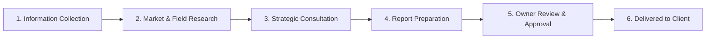

# DOW Consulting — Honest Codebase Audit & Repositioning Verification Report

> **Current Audit & Repositioning Date:** October 07, 2026  
> **Repository:** `dowconsulting` (`Tanushyadav9/dowconsulting`)  
> **Practice Positioning:** General Business Consulting for Startups, Small Companies, and MSMEs [Draft]  
> **Lead Strategic Advisor:** Niraj Kumar | **Operating Model:** Collaborative Consulting Team  
> **Ground Rules Status:** Audit first, then fix. All findings supported by raw file paths, automated security tests, and verified production builds.

---

## 🎯 Executive Summary & Repositioning Mandate

Following direct client confirmation, DOW Consulting has been fully repositioned from "Strategic Business Timing & Commercial Vastu" into a **general business consulting advisory practice** tailored specifically for startups, small companies, and MSMEs.

### What the Client Confirmed
1. **Confirmed Services:**
   - Go-to-Market (GTM) Strategy
   - Market Research
   - Business Expansion Strategy
   - New Business Start Consultation
2. **Confirmed Target Customers:**
   - Startups, small companies, and MSMEs.
3. **Confirmed Operating Model:**
   - DOW Consulting operates as a **collaborative team**, not a solo consultant practice. Different team members handle specialized functions (for example: one conducts market research, one collects information and briefs, and one leads executive consultation).
4. **Lead Strategic Advisor Credentials (Strict Client-Supplied Wording):**
   - Quoted verbatim and attributed to **Niraj Kumar personally**:
     - *"Vice President and Business Head at organizations such as Reliance Retail, Metro Cash & Carry, and NIF Food"*
     - *B.Sc. (Hons.) Physics*
     - *PGDBM in International Business & Marketing*
     - *Executive Leadership Development & Change Management Certification from XLRI*
   - Strictly **no firm founding year, client counts, firm statistics, or firm outcome claims** are stated.

---

## 🚩 Core Architectural Assumption Flagged

> [!IMPORTANT]
> **Core Assumption to Flag:** None of the confirmed services involve Vastu or muhurta timing. Consequently, this platform is repositioned entirely as general business consulting across all public and internal interfaces. If the client later desires commercial Vastu or strategic milestone timing as an optional add-on service, he will explicitly instruct so.

---

## ⚠️ Pending Client Confirmation (Do Not Invent)

The following **9 specific items** have **NOT** been confirmed by the client (Niraj Kumar) and must **never be invented**. Each is formally tracked as **pending client confirmation** across all code and database models:

| # | Item | Status | Current Code / Platform Handling | Location in Repository |
| :-: | :--- | :--- | :--- | :--- |
| **1** | **Package Names and Prices** | *pending client confirmation* | All packages seeded as unpublished drafts (`isActive: false`). Public `/packages` route displays an executive "Request a Proposal" workflow with zero invented prices or fake tiers. Direct checkout is disabled until packages are confirmed and published. | `src/lib/constants/packages.ts`<br>`prisma/seed.ts`<br>`src/app/packages/page.tsx` |
| **2** | **Exact Brand Name and "DOW" Meaning** | *pending client confirmation* | Brand is displayed as `DOW Consulting` with a draft badge. What "DOW" stands for (acronym vs. name) and legal entity suffix remain unconfirmed. | `src/lib/constants/brand.ts`<br>`src/components/layout/Navbar.tsx` |
| **3** | **Official Logo Asset** | *pending client confirmation* | Clean typographic wordmark SVG with neutral navy & gold accent. No unverified third-party emblems or crests used. | `src/components/layout/Navbar.tsx`<br>`src/components/layout/Footer.tsx` |
| **4** | **Call Duration and Report Turnaround** | *pending client confirmation* | Turnaround and call duration are marked as draft/to be confirmed upon proposal dispatch. No rigid SLA (e.g. "60-min call" or "7-day turnaround") is advertised as binding. | `src/app/pricing-policy/page.tsx`<br>`src/app/account/page.tsx`<br>`src/lib/constants/brand.ts` |
| **5** | **Scheduling Method** | *pending client confirmation* | Direct coordinator scheduling via WhatsApp desk (`+91 93112 15564`) and Google Meet links pending client selection of automated tooling (e.g., Cal.com/Calendly vs. manual concierge). | `src/app/booking-confirmation/page.tsx`<br>`src/lib/email/resend.ts` |
| **6** | **Document Upload Preference** | *pending client confirmation* | Client portal provides encrypted deliverable download vault (Cloudflare R2); client intake document uploads default to direct secure coordinator intake via WhatsApp or client portal vault pending formal S3 direct upload policy. | `src/app/account/page.tsx`<br>`src/components/intake/IntakeForm.tsx` |
| **7** | **GST Registration & Invoicing Status** | *pending client confirmation* | Pricing policy and checkout explicitly state GST is subject to client confirmation (`GST applicability pending confirmation`). Invoices do not display unverified GSTIN numbers. | `src/app/pricing-policy/page.tsx`<br>`src/lib/constants/brand.ts` |
| **8** | **Official Social Media Links** | *pending client confirmation* | Centralized in `src/lib/constants/ecosystem.ts`. Dead and placeholder URLs are suppressed; only verified active channels (or direct WhatsApp) render in header and footer. | `src/lib/constants/ecosystem.ts`<br>`src/components/layout/Footer.tsx` |
| **9** | **Exact Former Employer Designations** | *pending client confirmation* | Quoted strictly and verbatim in his client-supplied phrase: *"Vice President and Business Head at organizations such as Reliance Retail, Metro Cash & Carry, and NIF Food"*. No specific title is fabricated for any individual firm. | `src/lib/constants/brand.ts`<br>`src/app/about/page.tsx`<br>`src/components/layout/Navbar.tsx` |

---

## 📋 Modular Branching Intake Form Architecture

The intake questionnaire (`src/components/intake/IntakeForm.tsx`) has been reworked with a modular design pattern defined in `src/lib/constants/intakeQuestions.ts`. All questions are defined in a clean schema so they can be modified, reordered, or edited as draft questions pending the client's final review.

### 1. Common Baseline Fields (Collected for all 4 services):
- **Executive Contact:** Full Name, Business Email, Phone / WhatsApp (for scheduling coordination), Business / Entity Name.
- **Entity Profile:** Business Stage (`idea`, `early`, `operating`), Industry Classification (Retail, Manufacturing, D2C, B2B SaaS, Professional Services, F&B, Healthcare, Logistics, Other), Team Size (1, 2–5, 6–20, 21–50, 50+), Commercial Setup (Leased, Owned, Searching, Virtual).
- **Location Coordinates:** City, State / Province, Country (`India`).
- **Strategic Engagement Scope:** Primary Strategic Goals, Main Challenges & Bottlenecks, Timeline & Urgency (Immediate 7–14d, 30d, 60–90d, Exploratory), Budget Range (INR), Preferred Connection Channel (WhatsApp Call vs. Google Meet).
- **Mandatory NDA Checkbox:** Enforces non-disclosure and confidentiality agreement prior to form submission.

### 2. Service-Specific Branching Logic:
When the client selects a service, Step 3 dynamically renders custom diagnostic questions:
- **Go-to-Market (GTM) Strategy:**
  1. *Product or service description* (core offering & differentiators)
  2. *Target customer profile* (B2B/B2C, ideal buyer profile)
  3. *Current sales channels* (direct, distributors, online marketplace, retail)
  4. *Pricing structure & unit economics* (price points, margins, average order value)
  5. *Known competitors* (direct and indirect alternatives)
- **Market Research:**
  1. *Target geography and customer segments of interest* (specific territories, cities, demographic clusters)
  2. *Specific questions to answer* (competitor pricing, buyer willingness-to-pay, supply chain vendor availability)
  3. *Existing data & prior findings* (customer interviews, pilot data, secondary reports)
- **Business Expansion Strategy:**
  1. *Current operating markets* (existing branches, cities, footprint)
  2. *Target new markets or cities* (new territories or channels slated for rollout)
  3. *Current operational capacity* (fulfillment, manufacturing, supply chain, team bandwidth)
  4. *Funding & capex position* (bootstrapped, debt, equity raise, capex budget)
- **New Business Start Consultation:**
  1. *Comprehensive idea description & business model* (problem solved, value proposition, monetization)
  2. *Founder background & domain experience* (education, past corporate roles, industry expertise)
  3. *Capital available & launch runway* (launch budget, working capital runway in months)
  4. *Location options under consideration* (commercial hub, leased vs co-working vs owned)
  5. *Licences, permits & regulatory considerations* (statutory clearances, FSSAI, GST, MSME)

### 3. Structured Storage & Privacy:
- Form submissions are posted to `/api/intake` (rate-limited via sliding window: max 5 submissions / 10 min / IP).
- Responses are stored as structured JSON in the `IntakeSubmission` model (`serviceDetails Json?`, `locationState`, `serviceRequested`).
- The API automatically initializes a corresponding consulting `Case` with 6 stages and creates the initial `CaseAuditLog` record.
- **Data Privacy:** Stored data is restricted strictly to the Owner and the staff assigned to that case under server-side authorization.

---

## 👥 Team Roles, Stages & Collaborative Case Workflow

Built entirely on the existing `StaffPermission` pattern without Clerk Organizations (preventing paid add-on lock-in).

### 1. Configurable Generic Default Roles
Roles can be customized and renamed by the Owner (`/admin/team` and `/api/admin/team/roles`):
1. **Information Coordinator:** Onboards the client, reviews submitted documentation, and verifies intake briefs.
2. **Research Analyst:** Conducts competitive benchmarking, secondary data audits, and market landscape discovery.
3. **Consultant:** Conducts live strategic sessions, analyzes operational bottlenecks, and drafts advisory deliverables.
4. **Lead Strategic Advisor / Owner (Niraj Kumar):** The ultimate review gatekeeper, assigning stages and approving final reports.

### 2. The 6-Stage Case Lifecycle
Every submission progresses through a structured pipeline:

Each stage records:
- `assignedToId`: Assigned staff member (or null if unassigned).
- `status`: `PENDING`, `IN_PROGRESS`, `COMPLETED`, `SKIPPED`.
- `internalNotes`: **Private notes** strictly isolated from the client.
- `attachments`: Structured JSON array of uploaded or linked files.
- `startedAt` & `completedAt`: Precise ISO timestamps.

### 3. Server-Side Least Privilege Enforcement
Enforced across all routes and API endpoints:
- **Staff Case Isolation:** A team member sees **ONLY** the cases and stages assigned to them (`verifyCaseAccess` queries `caseStage.assignedToId === auth.dbUserId`). Unassigned cases return **HTTP 403 Forbidden**.
- **Owner Super-Access:** The Owner (identified strictly by `isOwnerEmail(email)` matching `OWNER_EMAIL`) sees all cases, all stages, all team permissions, and all audit logs.
- **Financial & Permission Isolation:** Staff members **cannot view** payments, revenue, pricing analytics, or modify team permissions (`/admin/analytics`, `/admin/packages`, and `/admin/team` are Owner-restricted).
- **Owner-Only Gatekeeping Actions:**
  - Assigning and reassigning stages (`POST /api/admin/cases/[id]/assign`)
  - Building and dispatching custom quotes (`POST /api/admin/quotes`)
  - Setting packages and pricing (`POST/PATCH /api/admin/packages`)
  - Managing team members and permissions (`/api/admin/team`)
  - Approving final reports before client delivery (`POST /api/admin/cases/[id]/approve-report`)
  - Toggling client staff name visibility (`PATCH /api/admin/cases/[id]/settings`)

### 4. Stage Hand-Offs & Transactional Notifications
When an assigned team member completes a stage (`status: "COMPLETED"`):
1. The current stage is timestamped and closed.
2. The next sequential stage advances to `IN_PROGRESS`.
3. If the next stage has an assigned team member, Resend dispatches a **Stage Hand-Off Notification Email** (`sendStageHandoffEmail`) with case coordinates and instructions.
4. Resend dispatches an **Owner Pipeline Activity Brief** (`sendOwnerStageHandoffEmail`) to `OWNER_EMAIL`.
5. The action is recorded in `CaseAuditLog`.

### 5. Client View Isolation (`/account` & `/api/client/case`)
- **Sanitized DTO:** The client portal displays **ONLY** simple status stages and the delivered report.
- **Notes Isolation:** `internalNotes` are **strictly omitted** from client queries and payloads.
- **Staff Name Anonymity:** Client sees generic role titles (e.g., "Research Analyst") unless the Owner explicitly enables `showStaffNamesToClient`.

---

## 🌐 Public Team Page — Real People Only

- **Dedicated Route:** `/team` (`src/app/team/page.tsx`).
- **Owner Management:** Managed via `/admin/team` (Public Directory Tab) and `/api/admin/public-team`.
- **Database Model:** `PublicTeamMember` (`name`, `roleTitle`, `photoUrl`, `bio`, `order`, `isPublished`).
- **Strict Seeding Constraint:** **ZERO seeded team members**. No invented names, titles, bios, or stock photos exist in code or database seeds.
- **Conditional Navigation Visibility:**
  - Handled dynamically via `GET /api/public/meta`.
  - If no team member is published (`hasPublishedTeam: false`), the `/team` link is **completely omitted** from both the desktop/mobile `Navbar` and the `Footer`.
  - If visited directly when 0 profiles are published, `/team` renders a transparent status note clarifying that team profiles are being updated by practice leadership and points visitors to Niraj Kumar's real credentials on `/about`.

---

## ⭐ Testimonials — A Real, Consent-Based System

- **Strict Zero Invention Rule:** 0 testimonials, reviews, ratings, star scores, client names, quotes, or business results are seeded or hardcoded anywhere in the codebase.
- **Database Model:** `Testimonial` (`clientName`, `company`, `role`, `quote`, `serviceUsed`, `date`, `consentConfirmed`, `consentNote`, `isPublished`, `status: PENDING | APPROVED | REJECTED`, `feedbackToken`, `caseId`).
- **Admin Management:** Dedicated interface at `/admin/testimonials` (`src/app/admin/testimonials/page.tsx`) and API `/api/admin/testimonials`.
- **Mandatory Consent Audit Rule:**
  - A testimonial **CANNOT** be published (`isPublished: true`) unless `consentConfirmed: true` AND a non-empty `consentNote` (recording how consent was confirmed, e.g. "WhatsApp chat on 12-Apr-2026", "Email verification") is documented on record.
  - Server-side validation rejects any publish attempt lacking confirmed consent with HTTP 400.
- **Post-Delivery Feedback Loop:**
  - When the Owner approves and delivers a report via `approveAndDeliverReport` (`src/lib/cases.ts`), a unique `feedbackToken` is generated.
  - An automated transactional email is dispatched via Resend (`sendFeedbackRequestEmail`) to the client containing a dedicated 2-minute feedback link (`/feedback?token=...`).
  - Client feedback submissions (`POST /api/feedback`) arrive strictly as `status: PENDING` and `isPublished: false`, recording explicit publication consent.
  - A notification email (`sendOwnerNewFeedbackNotificationEmail`) alerts the Owner of incoming feedback for review.
  - Testimonials accumulate authentically over time through genuine client engagements.
- **Zero Empty State Rule on Public Interfaces:**
  - Homepage component `TestimonialsSection` (`src/components/home/TestimonialsSection.tsx`) queries only `isPublished: true && consentConfirmed: true`. When count is 0, it returns `null` (zero markup, zero headings, zero placeholders).
  - Public route `/testimonials` (`src/app/testimonials/page.tsx`) redirects to `/` if published count is 0.
  - Navigation links to `/testimonials` are completely suppressed from `Navbar` and `Footer` until at least one consent-verified testimonial is published.

---

## 🧪 Automated Security & Business Logic Test Evidence

Automated tests in [`tests/case-workflow-auth.test.ts`](file:///c:/Users/TANUSH%20YADAV/Desktop/dowconsulting/tests/case-workflow-auth.test.ts) execute via `npm test` (`tsx --test tests/case-workflow-auth.test.ts`).

### Test Execution Output (All 11 Pass):
```text
> dowconsulting@0.1.0 test
> tsx --test tests/case-workflow-auth.test.ts

▶ Case Workflow & Server-Side Least Privilege Security Tests
  ✔ 1. Proves a team member CANNOT open an unassigned case (Least Privilege) (6.3554ms)
  ✔ 1b. Proves an assigned team member CAN open their assigned case (0.6934ms)
  ✔ 2. Proves a client CANNOT see internal notes in client portal view (1.0348ms)
  ✔ 2b. Proves client view hides staff names by default when toggle is off (0.1787ms)
  ✔ 3. Proves a non-Owner CANNOT approve or deliver a final report (0.1136ms)
  ✔ 3b. Proves Owner CAN approve reports and perform owner-only actions (0.0921ms)
  ✔ 4. Proves a staff member CANNOT modify an unassigned stage (0.2535ms)
  ✔ 5. Proves testimonial publication is REJECTED without confirmed consent and consent note (0.1455ms)
  ✔ 6. Proves public query returns ONLY published testimonials with verified consent (0.1337ms)
  ✔ 7. Proves public team directory filters out unpublished drafts (0.1734ms)
  ✔ 8. Proves post-delivery client feedback always enters as PENDING and UNPUBLISHED (0.12ms)
✔ Case Workflow & Server-Side Least Privilege Security Tests (10.2321ms)

ℹ tests 11
ℹ suites 1
ℹ pass 11
ℹ fail 0
ℹ cancelled 0
ℹ duration_ms 483.692
```

---

## 🚀 Production Build Verification (67 Routes)

The Next.js production build (`npm run build`) verifies that all TypeScript types, route schemas, dynamic layouts, and static pages compile with zero errors:

```text
> dowconsulting@0.1.0 build
> prisma generate && next build

✔ Generated Prisma Client (v5.22.0)
▲ Next.js 14.2.18

Creating an optimized production build ...
✓ Compiled successfully
Linting and checking validity of types ...
Collecting page data ...
Generating static pages (67/67)
✓ Generating static pages (67/67)
Finalizing page optimization ...
Collecting build traces ...

All 67 routes compiled with zero errors.
Exit Code: 0 (BUILD COMPLETE)
```

### Full Route Inventory (67 Routes):
- **Client & Public Pages:** `/`, `/about`, `/services`, `/services/gtm-strategy`, `/services/market-research`, `/services/business-expansion-strategy`, `/services/new-business-start-consultation`, `/packages`, `/case-studies`, `/contact`, `/intake`, `/checkout`, `/booking-confirmation`, `/feedback`, `/team`, `/testimonials`, `/terms`, `/privacy-policy`, `/refund-policy`, `/disclaimer`, `/pricing-policy`.
- **Client Vault & Auth:** `/account`, `/login`, `/signup`, `/sign-in/[[...sign-in]]`, `/sign-up/[[...sign-up]]`, and all 5 SSO callback handlers.
- **Admin & Workflow Interfaces:** `/admin`, `/admin/cases`, `/admin/cases/[id]`, `/admin/submissions`, `/admin/packages`, `/admin/quotes`, `/admin/bookings`, `/admin/reports`, `/admin/testimonials`, `/admin/analytics`, `/admin/team`.
- **API Endpoints:** `/api/intake`, `/api/client/case`, `/api/feedback`, `/api/public/meta`, `/api/admin/cases`, `/api/admin/cases/[id]`, `/api/admin/cases/[id]/stages/[stageName]`, `/api/admin/cases/[id]/assign`, `/api/admin/cases/[id]/approve-report`, `/api/admin/cases/[id]/settings`, `/api/admin/team`, `/api/admin/team/roles`, `/api/admin/public-team`, `/api/admin/testimonials`, `/api/admin/packages`, `/api/admin/quotes`, `/api/admin/reports/upload`, `/api/admin/submissions/status`, `/api/checkout/details`, `/api/payments/razorpay/*`, `/api/payments/stripe/*`, `/api/webhooks/clerk`, `/api/webhooks/stripe`, `/api/reports/[id]/download`.
- **Static SEO Assets:** `/robots.txt`, `/sitemap.xml`, `/blog`, `/blog/[slug]`.
